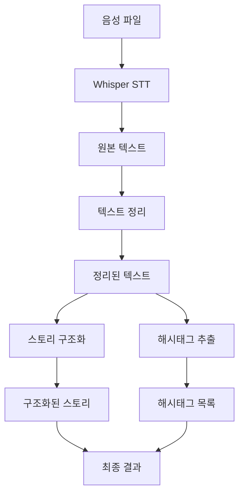

# 🎙️ STT 음성 처리 시스템

음성을 텍스트로 변환하고 AI를 활용해 스토리를 정리하는 멀티모달 RAG 시스템입니다.

## 📋 프로젝트 개요

이 프로젝트는 음성 인식(STT)과 대화형 AI(LLM)를 결합하여 음성 데이터를 구조화된 텍스트로 변환하고, 스토리를 정리하며 해시태그를 추출하는 시스템입니다.

### 🎯 주요 기능
- **음성 인식**: OpenAI Whisper를 사용한 고품질 STT
- **텍스트 정리**: 습관어 제거 및 자연스러운 문장 재구성
- **스토리 구조화**: 논리적인 문단별 정리 및 핵심 포인트 추출
- **해시태그 추출**: AI 기반 키워드 및 해시태그 생성
- **멀티모달 처리**: 음성 → 텍스트 → 구조화된 콘텐츠 파이프라인

## 🏗️ 아키텍처

```
src/
├── core/           # 핵심 구성 요소
│   ├── config.py   # 설정 관리
│   ├── state.py    # 상태 및 데이터 모델
│   └── workflow.py # LangGraph 워크플로우
├── processors/     # 데이터 처리기
│   └── stt_processor.py # Whisper STT 처리
├── chains/         # LangChain 체인들
│   ├── cleaning_chain.py    # 텍스트 정리
│   ├── organize_chain.py    # 스토리 구조화
│   └── tagging_chain.py     # 해시태그 추출
├── services/       # 비즈니스 로직
│   └── voice_service.py # 음성 처리 서비스
├── interfaces/     # 사용자 인터페이스
│   ├── streamlit_app.py # Streamlit 웹 앱
│   └── fastapi_app.py   # FastAPI 서버 (Phase 2)
└── utils/          # 유틸리티
    ├── audio_utils.py
    └── text_utils.py
```

## 🚀 Phase 1: Ollama + Streamlit (현재)

### ✅ 구현된 기능

#### 1. 음성 인식 (STT)
- **모델**: OpenAI Whisper (base 모델)
- **언어**: 한국어 최적화
- **지원 형식**: WAV, MP3, MP4, M4A, FLAC, OGG
- **최대 파일 크기**: 50MB

#### 2. 텍스트 정리
- **습관어 제거**: "음...", "어...", "그..." 등
- **불필요한 반복 제거**: 같은 단어/구문 반복
- **망설임 표현 정리**: "아니", "잠깐" 등
- **자연스러운 문장 재구성**: 한국어 문법에 맞게 수정

#### 3. 스토리 구조화
- **제목 생성**: 내용을 요약한 제목
- **요약 생성**: 핵심 내용 요약
- **섹션 분할**: 논리적인 문단별 정리
- **핵심 포인트 추출**: 각 섹션의 주요 내용

#### 4. 해시태그 추출
- **키워드 추출**: AI 기반 핵심 키워드 식별
- **해시태그 생성**: #형태의 태그 자동 생성
- **관련성 점수**: 각 태그의 관련성 평가

#### 5. 웹 인터페이스 (Streamlit)
- **파일 업로드**: 드래그 앤 드롭 지원
- **실시간 처리**: 진행률 표시
- **결과 비교**: 원본 vs 정리된 텍스트
- **구조화된 결과**: 탭별 결과 표시
- **샘플 테스트**: 개발용 샘플 데이터

### 🛠️ 기술 스택

#### Backend
- **Python 3.11+**: 메인 언어
- **OpenAI Whisper**: 음성 인식
- **LangChain**: LLM 체인 관리
- **LangGraph**: 워크플로우 오케스트레이션
- **Ollama**: 로컬 LLM 서버 (llama2 모델)

#### Frontend
- **Streamlit**: 웹 인터페이스
- **반응형 UI**: 모바일 친화적 디자인

#### 개발 도구
- **uv**: 패키지 관리
- **Git**: 버전 관리

### 📦 설치 및 실행

#### 1. 사전 요구사항
```bash
# Ollama 설치 (macOS)
brew install ollama

# Ollama 서버 시작
ollama serve

# llama2 모델 다운로드
ollama pull llama2
```

#### 2. 프로젝트 설정
```bash
# 프로젝트 클론
git clone <repository-url>
cd stt-project/backend

# 의존성 설치
uv sync

# 환경 변수 설정 (선택사항)
export WHISPER_MODEL=base
export LLM_MODEL=llama2
export MAX_AUDIO_SIZE_MB=50
```

#### 3. 실행
```bash
# Streamlit 앱 실행
uv run streamlit run src/interfaces/streamlit_app.py

# 브라우저에서 http://localhost:8501 접속
```

### 🔧 설정 옵션

| 환경 변수 | 기본값 | 설명 |
|-----------|--------|------|
| `WHISPER_MODEL` | `base` | Whisper 모델 크기 |
| `WHISPER_LANGUAGE` | `ko` | 인식 언어 |
| `LLM_MODEL` | `llama2` | Ollama 모델명 |
| `LLM_BASE_URL` | `http://localhost:11434` | Ollama 서버 URL |
| `MAX_AUDIO_SIZE_MB` | `50` | 최대 파일 크기 |
| `SESSION_TIMEOUT_MINUTES` | `30` | 세션 타임아웃 |

## 🚀 Phase 2: FastAPI + Flutter (계획)

### 📋 예정 기능

#### 1. FastAPI 백엔드
- **RESTful API**: 음성 처리 엔드포인트
- **비동기 처리**: 대용량 파일 처리
- **인증 시스템**: JWT 기반 사용자 인증
- **데이터베이스**: 처리 결과 저장
- **WebSocket**: 실시간 처리 상태 업데이트

#### 2. Flutter 모바일 앱
- **크로스 플랫폼**: iOS/Android 지원
- **음성 녹음**: 실시간 음성 캡처
- **오프라인 모드**: 로컬 처리 지원
- **동기화**: 클라우드 데이터 동기화

#### 3. 확장 기능
- **사용자 관리**: 개인화된 설정
- **히스토리**: 처리 기록 관리
- **공유 기능**: 결과 공유 및 협업
- **API 연동**: 외부 서비스 연동

### 🔄 LLM 옵션

#### Ollama (로컬)
- **장점**: 프라이버시 보호, 오프라인 사용
- **모델**: llama2, gemma2, mistral 등
- **사용 사례**: 개인/기업 내부 사용

#### OpenAI (클라우드)
- **장점**: 높은 성능, 최신 모델
- **모델**: GPT-4, GPT-3.5-turbo
- **사용 사례**: 상용 서비스, 고품질 요구

## 📊 처리 파이프라인



## 🧪 테스트

### 샘플 데이터
```bash
# 샘플 텍스트 테스트
# Streamlit 앱에서 "샘플 음성 생성" 버튼 클릭
```

### 개발 모드
```bash
# 디버그 정보 확인
# Streamlit 사이드바 하단의 "디버그 정보" 확장
```

## 📈 성능 최적화

### 현재 최적화
- **모델 캐싱**: Whisper 모델 메모리 로딩
- **비동기 처리**: LangChain 비동기 실행
- **임시 파일 관리**: 자동 정리

### 예정 최적화
- **GPU 가속**: CUDA 지원
- **배치 처리**: 다중 파일 동시 처리
- **캐싱 시스템**: Redis 기반 결과 캐싱

## 🤝 기여하기

1. Fork the repository
2. Create a feature branch
3. Commit your changes
4. Push to the branch
5. Create a Pull Request

## 📄 라이선스

이 프로젝트는 MIT 라이선스 하에 배포됩니다.

## 📞 지원

문제가 있거나 제안사항이 있으시면 이슈를 생성해주세요.

---

**현재 상태**: Phase 1 완료 ✅  
**다음 단계**: Phase 2 개발 시작 🚀
